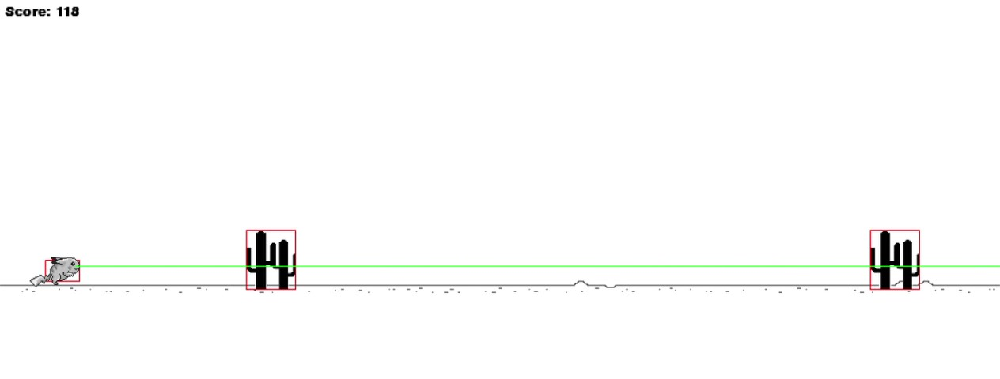
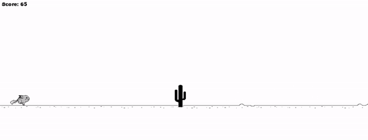
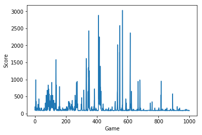
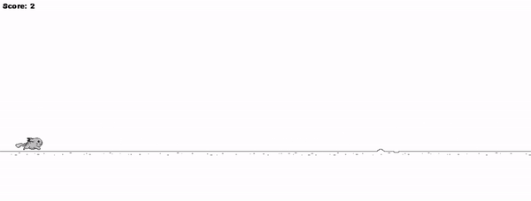

# PokeDash-AI: An Artificial Intelligence Experiment
_Disclaimer: I would not consider this code clean and error-free, thus it is not structured for reuse by others. Additionally, I was not following the PEP 8 style of coding so common python community standards and conventions were not followed._
## Introduction
After completing an introductory course into Deep Learning, I finally had a basic understanding sufficient enough to start a project that I've been itching to do for a while. The challenge is simple: "Can I create an neural network that can learn to play a game?"

The first few weeks of 2019 was spent learning how to use [PyGame](https://www.pygame.org/docs/), an Open Source python package allowing user to design and build multimedia applications such as games. At the beginning of June, I gave myself two weeks to build the game then train a reinforcement learning algoritm ontop of it.

The chosen game was Google's hidden T-Rex Runner; a great source of distraction as you wait for your modem to restart. In order to not let my sample space be too large, I did not incorporate the ability to _duck_ or include flying obstacles (my 6GB of RAM would cry).

Thus, the model only needed to figure out when to jump, and when not to jump. Below is a snapshot of the hitboxes and a fictitious "view" from the player.

Overview of Model:
Inputs:
Outputs:

## Baselines

### Random Model
In order to accurately identifiy learning, I first built in a neural network that provides random inputs. Accordingly, it was observed that for each iteration of the game, a random model would rarely score above 100 and averaged a score of 90.

### Manual Model

Of course, it would be remiss of me to ask my model to solve something I could not conceptually solve. After going through a few iterations, it was found that a simplistic, but exceptonal, solution was jumping when an obstacle is equal to or less than 20 pixels away.

## DQN Model

## Results

## Key Takeaways

## Future Considerations

## References
* Inspiration for Python Code: https://github.com/shivamshekhar/Chrome-T-Rex-Rush
